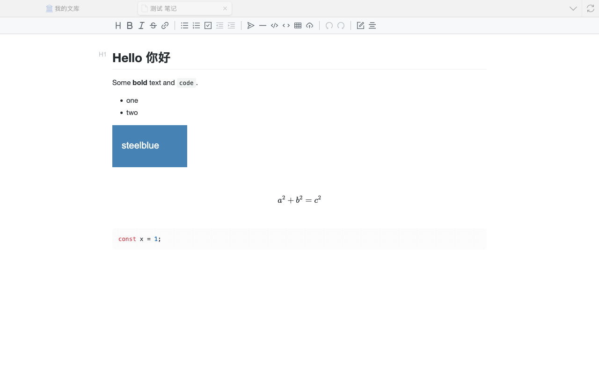

# Markdown Editor for Zotero

Edit Markdown attachments in a Zotero tab. Pasted screenshots and dropped images are saved
next to the note, so they sync with it to every device that syncs your Zotero files.



## The problem

Write a note in Typora or another desktop editor and paste a screenshot, and the image lands at
a path on that computer (`/Users/me/Library/…/image.png`). Add the `.md` to Zotero and it syncs,
but the images don't: other devices see broken links.

## How it works

Zotero syncs a stored attachment as its whole storage directory, not just the main file:

- WebDAV always uploads `storage/<KEY>/` as `<KEY>.zip`.
- Zotero File Storage does the same for `text/*` attachments (`_isZipUpload` in
  `xpcom/storage/zfs.js`).
- `Zotero.File.zipDirectory` recurses into subfolders and skips dotfiles, and
  `_processZipDownload` recreates the subfolders on the other end.

So the editor writes each pasted image to `storage/<KEY>/<note>.assets/` and links it as
`<note>.assets/image-20260930121500123.png`. That's the `./${filename}.assets/` layout Typora
uses, so the note still opens correctly in Typora. Inserting the link changes the `.md`, which is
what triggers the upload.

## Install

Download `zotero-md-editor-0.1.0.xpi` from
[Releases](https://github.com/lin-qingming/zotero-md-editor/releases), then in Zotero:
**Tools → Plugins → gear icon → Install Plugin From File…**. Requires Zotero 8 or later.
Updates arrive through Zotero's plugin updater.

To build it yourself:

```
npm install
npm run xpi
```

## Use

- **Double-click** a `.md` attachment to open it in a Zotero tab.
- **Right-click a Markdown attachment → Open with External App** to use Typora etc. as before.
  To make that the default for double-click, set
  `extensions.zotero-md-editor.openInZotero` to `false` in the Config Editor.
- **Right-click an item → New Markdown Note**, or **New Note → New Standalone Markdown Note**
  in the toolbar, to create one.
- **Paste** a screenshot, or **drop** image files, into the editor. Other dropped files are
  stored the same way and linked instead of embedded.
- Saves automatically about a second after you stop typing, and on **Cmd/Ctrl+S** and when the tab
  closes.
- **Cmd/Ctrl+click** a link to open it in the browser.

The editor is [Vditor](https://github.com/Vanessa219/vditor) in its instant-rendering mode,
similar to Typora. The toolbar's mode button switches to split source view. KaTeX math,
Mermaid diagrams and syntax highlighting are included. MathJax, Graphviz, ECharts and the other
Vditor extras are left out to keep the plugin around 3 MB, so those blocks show as source.

## Behaviour worth knowing

- **Opening a note never rewrites it.** The file is only written after you edit. Once you do,
  Vditor saves it in its own normalised Markdown (list markers, blank lines, table padding),
  so the first save may change more lines than you touched.
- **Changes on disk.** When the file changes while its tab is open (from a sync, another app,
  or a rename) and you have no unsaved edits, the tab reloads. If you do have unsaved edits,
  you're asked whether to keep your version or load the one on disk.
- **Existing notes with absolute image paths** still display, since the editor reads local
  files by absolute path or `file://` URL too. Those images still won't sync; only images under
  the note's own folder do.
- **Linked files** (added with "Attach Link to File") can be edited too, but Zotero doesn't
  sync linked files, so the editor shows a banner saying so.
- **Tabs aren't restored after a restart.** Zotero restores tabs before plugins load, and
  would fail on a tab type it doesn't know, so these tabs are left out of the saved session.
- **Zotero's mobile apps** can open the `.md` but not this editor.

## Design notes

- `src/main.ts` runs in Zotero. It wraps `Zotero.FileHandlers.open`, which
  `ZoteroPane.viewAttachment` calls only once the file is on disk, after downloading it on demand
  if needed. It adds a `mdeditor` tab type. There's no hyphen because `Zotero_Tabs.parseTabType`
  splits on it. It also reads and writes the note and its images.
- `src/editor.ts` is the page inside the tab: `resource://zotero-md-editor/editor.html` in a
  `type="content"` iframe, which is how Zotero's note editor is set up. It has to be
  unprivileged. Firefox sanitises `innerHTML` in privileged documents, which strips Vditor's
  toolbar, and an unprivileged page is also the safer place to render Markdown synced from
  elsewhere. The page's CSP allows only the plugin's own scripts.
- Because the page can't read `file://`, each rendered `` with a local `src` is sent to the
  host, which returns the file as a `data:` URL. Only the element's `src` changes. The Markdown
  keeps the relative path.
- The two sides talk via `postMessage` (`src/types.ts`), with binary data as base64. As a tab
  closes, the host also reads any edit Vditor hasn't reported yet, synchronously, so the last
  keystrokes aren't lost.
- Notes are written through a dotfile temp path (`.<name>.md.tmp`), because Zotero leaves
  dotfiles out of the sync ZIP.
